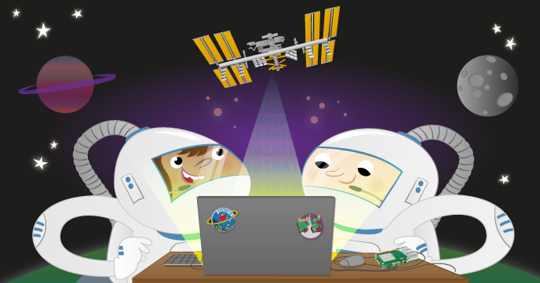

# Astro Pi Flight Data Analysis

The two Astro Pi flight computers on board the ISS are programmed to run the competition winning programs as part of an automatic sequence.  Each program will have one week of run time. After this sequence has completed the Astro Pis will enter a flight recorder mode where they record sensor readings into a database every 10 seconds.

We anticipate the Astro Pis will be left in this mode for at least a week, probably more. The product of this will be a large [CSV](https://en.wikipedia.org/wiki/Comma-separated_values) file which you can download and analyse. This resource will show you how to do this.

## Worksheet

- [Worksheet](worksheet.md)

## Licence

Unless otherwise specified, everything in this repository is covered by the following licence:

***Getting Started with Physical Computing*** by the [Raspberry Pi Foundation](http://www.raspberrypi.org) is licenced under a [Creative Commons Attribution 4.0 International License](http://creativecommons.org/licenses/by-sa/4.0/).

Based on a work at https://github.com/raspberrypilearning/astro-pi-flight-data-analysis
